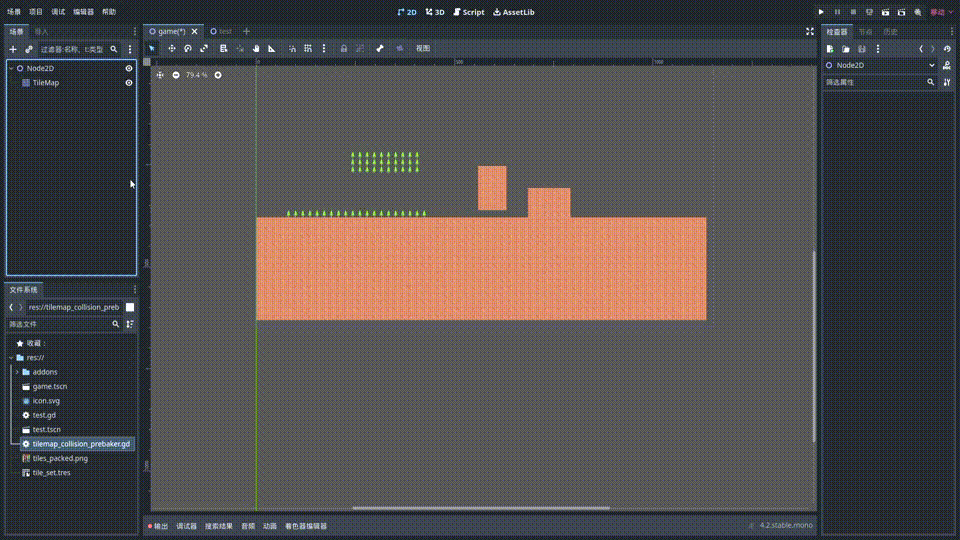

# Godot 4.x TileMapCollisionPrebaker

#### 介绍
适用于Godot 4.x 的TileMap碰撞预烘培器.旨在避免一些奇怪的bug,比如RigidBody2D在TileMap地面上移动时会时不时受阻(https://github.com/godotengine/godot/issues/47148). 
其实Github上已经有一个类似的工具了:https://github.com/popcar2/GodotTilemapBaker 
不过似乎有点简陋:完全无视PhysicsLayer和TileSet中TileData的Collision Polygon,所以就自己重新实现了一个更完善的,
可以烘培所有Layer和PhysicsLayer.

#### 安装教程

1.   在目标TileMap所在场景的任意地方,创建一个Node2D
2.   把脚本挂载到上面
3.   指定目标TileMap

#### 使用说明

1.  在一个Node2D节点上挂载此脚本
2.  设置目标TileMap
3.  点击bake

#### 参与贡献

1.  Fork 本仓库
2.  新建 Feat_xxx 分支
3.  提交代码
4.  新建 Pull Request